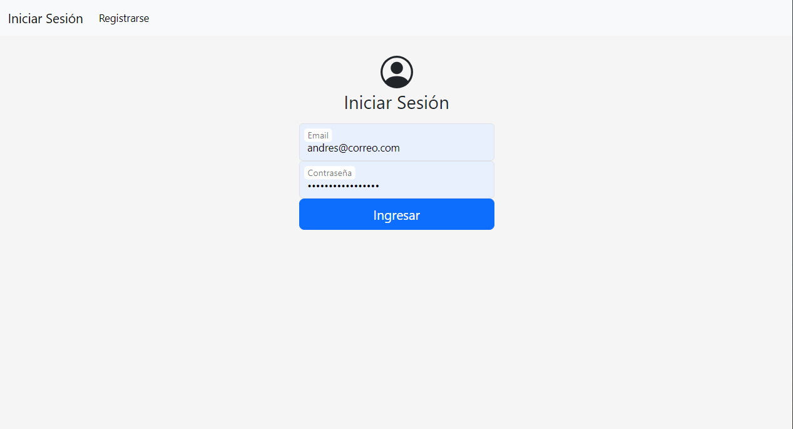
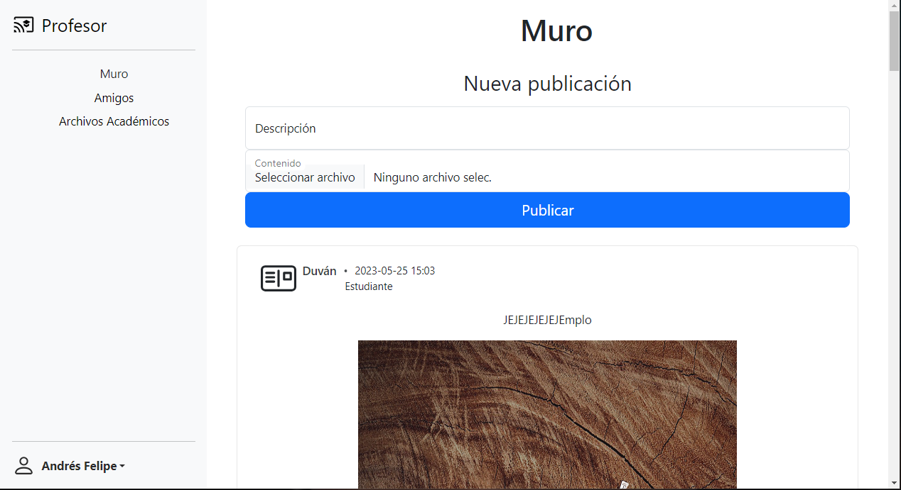
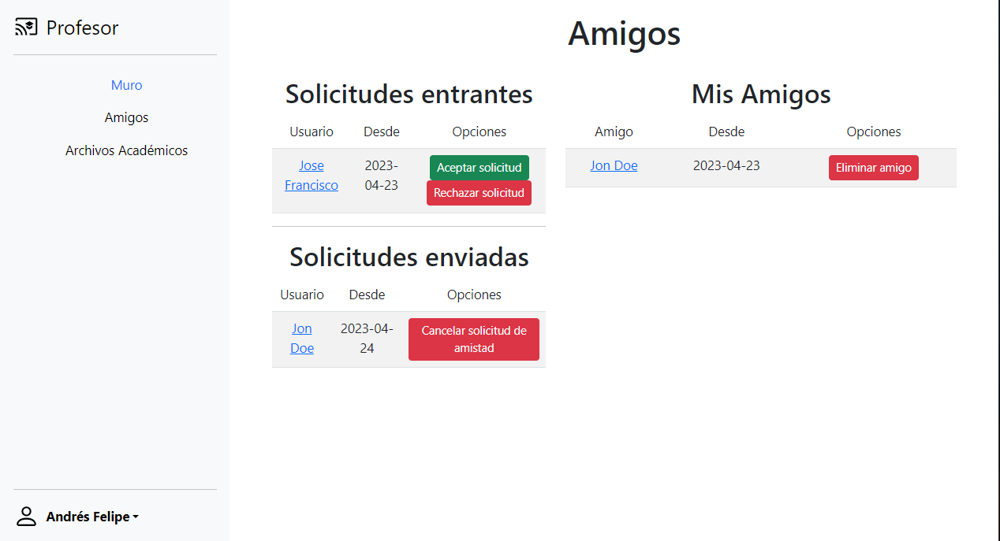
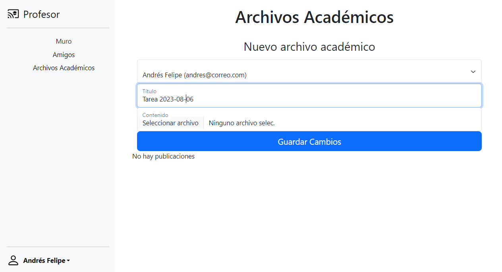
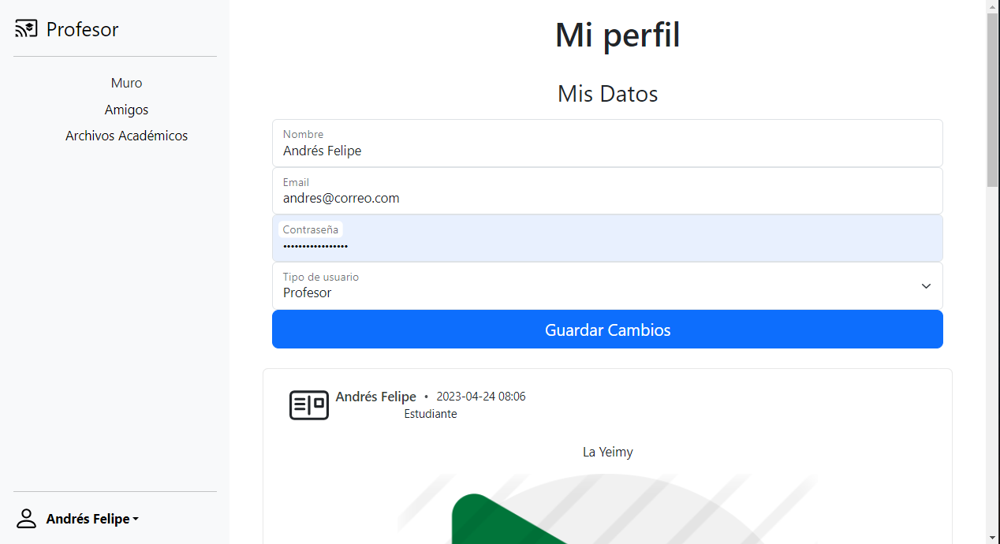

# Red Social Universitaria 🎓

Una plataforma diseñada para conectar estudiantes, profesores y personal administrativo de universidades.

---

## 📘 Descripción

La Red Social Universitaria tiene como objetivo facilitar la comunicación y colaboración entre los miembros de la comunidad universitaria. Aquí, los usuarios pueden compartir recursos, discutir sobre temas académicos y participar en actividades universitarias.

### 📸 Capturas de pantalla

*Página de login*


*Página de inicio*


*Sección de amigos*


*Sección de archivos académicos*


*Página de perfil*


---

## 🛠 Requerimientos

- Python 3.x
- pip
- virtualenv
- [Otros requerimientos](requirements.txt)

---

## 🚀 Pasos para ejecutar el proyecto

### 1. Clonar el repositorio

```bash
git clone https://github.com/Glitch-art/Red-Social-Universitaria.git
```

### 2. Instalar virtualenv

```bash
pip install virtualenv
```

### 3. Crear un entorno virtual

```bash
py -3 -m venv env
```

### 4. Activar el entorno virtual

Windows:

```bash
env\Scripts\activate.bat
```

Linux/Mac:

```bash
source env/bin/activate
```

### 5. Actualizar pip

```bash
python.exe -m pip install --upgrade pip
```

### 6. Instalar las dependencias

```bash
pip install -r requirements.txt
```

### 7. Crea la base de datos segun el archivo config


### 8. Ejecutar el proyecto

```bash
python src/app.py
```
